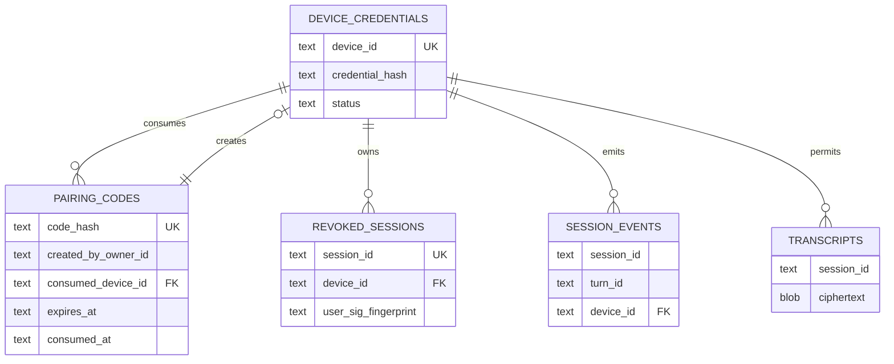

# Commercial Voice SQLite Architecture

> 上游契约：`docs/commercial-upgrade-SPEC.md` v1.1
> 适用范围：单用户 Windows 本地控制面；不引入 PostgreSQL、Redis 或远端分析库
> 当前商业发布裁决：FAIL。本文件定义目标数据契约，不代表迁移或运行时已经实现。

## 1. 数据边界与运行参数

SQLite 只保存本地设置、身份哈希、安全状态、脱敏事件和用户显式开启后的加密转写。禁止保存 pairing_code、nonce、device credential、TRTC SecretKey、userSig、第三方 token 的明文，以及原始音频、截图、代码或完整诊断文本。

推荐连接参数：

```sql
PRAGMA foreign_keys = ON;
PRAGMA journal_mode = WAL;
PRAGMA synchronous = FULL;
PRAGMA busy_timeout = 5000;
PRAGMA trusted_schema = OFF;
```

生产数据库文件及 `-wal`、`-shm` 只允许当前 Windows 用户访问。应用启动必须先执行迁移且校验 schema version；迁移失败时语音控制面 fail-closed，不得带旧 schema 继续签发凭证。

## 2. ER 图



## 3. Canonical DDL

时间字段统一存 UTC RFC 3339 文本，生成与比较都使用应用层 UTC；UUID 存规范小写文本。`metadata_json` 必须在 service 层经过 allowlist 校验。

本 schema 由 Spec v1.1 锁定的 9 张最小业务表，加 1 张迁移基础设施元数据表 `schema_migrations` 组成。`schema_migrations` 仅记录 schema 版本、校验和与应用时间，不属于 9 张业务表契约；物理 schema 因此包含 10 张表，不得将其误写为“第 10 张业务表”或“总共只有 9 张物理表”。

```sql
BEGIN IMMEDIATE;

-- 迁移基础设施元数据表：不计入 Spec v1.1 的 9 张最小业务表。
CREATE TABLE IF NOT EXISTS schema_migrations (
  id INTEGER PRIMARY KEY,
  version INTEGER NOT NULL UNIQUE,
  checksum TEXT NOT NULL,
  applied_at TEXT NOT NULL
) STRICT;

CREATE TABLE settings (
  id TEXT PRIMARY KEY,
  key TEXT NOT NULL UNIQUE,
  value_encrypted BLOB NOT NULL,
  created_at TEXT NOT NULL,
  updated_at TEXT NOT NULL
) STRICT;

CREATE TABLE device_credentials (
  id TEXT PRIMARY KEY,
  device_id TEXT NOT NULL UNIQUE,
  device_name TEXT NOT NULL CHECK(length(device_name) BETWEEN 1 AND 80),
  platform TEXT NOT NULL CHECK(platform IN ('android','windows_sidecar')),
  credential_hash TEXT NOT NULL,
  status TEXT NOT NULL CHECK(status IN ('active','expired','revoked')),
  expires_at TEXT NOT NULL,
  last_seen_at TEXT,
  revoked_at TEXT,
  revoke_reason TEXT CHECK(revoke_reason IS NULL OR length(revoke_reason) <= 200),
  created_at TEXT NOT NULL,
  updated_at TEXT NOT NULL,
  CHECK((status = 'revoked' AND revoked_at IS NOT NULL) OR status <> 'revoked')
) STRICT;

CREATE INDEX idx_device_credentials_status ON device_credentials(status);
CREATE INDEX idx_device_credentials_revoked_at ON device_credentials(revoked_at);
CREATE INDEX idx_device_credentials_expires_at ON device_credentials(expires_at);

CREATE TABLE pairing_codes (
  id TEXT PRIMARY KEY,
  code_hash TEXT NOT NULL UNIQUE,
  created_by_owner_id TEXT NOT NULL,
  device_name_hint TEXT CHECK(device_name_hint IS NULL OR length(device_name_hint) BETWEEN 1 AND 80),
  platform TEXT NOT NULL CHECK(platform = 'android'),
  expires_at TEXT NOT NULL,
  consumed_at TEXT,
  consumed_device_id TEXT,
  created_at TEXT NOT NULL,
  updated_at TEXT NOT NULL,
  FOREIGN KEY(consumed_device_id) REFERENCES device_credentials(device_id),
  CHECK((consumed_at IS NULL AND consumed_device_id IS NULL) OR
        (consumed_at IS NOT NULL AND consumed_device_id IS NOT NULL))
) STRICT;

CREATE INDEX idx_pairing_codes_expires_at ON pairing_codes(expires_at);
CREATE INDEX idx_pairing_codes_consumed_at ON pairing_codes(consumed_at);

CREATE TABLE revoked_sessions (
  id TEXT PRIMARY KEY,
  session_id TEXT NOT NULL UNIQUE,
  device_id TEXT NOT NULL,
  user_sig_fingerprint TEXT NOT NULL,
  expires_at TEXT NOT NULL,
  revoked_at TEXT NOT NULL,
  reason TEXT NOT NULL CHECK(length(reason) BETWEEN 1 AND 200),
  created_at TEXT NOT NULL,
  updated_at TEXT NOT NULL,
  FOREIGN KEY(device_id) REFERENCES device_credentials(device_id)
) STRICT;

CREATE INDEX idx_revoked_sessions_device_id ON revoked_sessions(device_id);
CREATE INDEX idx_revoked_sessions_expires_at ON revoked_sessions(expires_at);

CREATE TABLE session_events (
  id TEXT PRIMARY KEY,
  session_id TEXT NOT NULL,
  turn_id TEXT,
  device_id TEXT NOT NULL,
  event_type TEXT NOT NULL,
  state TEXT,
  error_code INTEGER,
  metadata_json TEXT NOT NULL DEFAULT '{}',
  created_at TEXT NOT NULL,
  updated_at TEXT NOT NULL,
  FOREIGN KEY(device_id) REFERENCES device_credentials(device_id),
  CHECK(json_valid(metadata_json)),
  CHECK(state IS NULL OR state IN ('IDLE','SIGNING','ENTERING','IN_ROOM','EXITING')),
  CHECK(error_code IS NULL OR error_code IN
    (40001,40101,40102,40103,40401,40801,40901,41301,42901,50300,50401))
) STRICT;

CREATE INDEX idx_session_events_session_id ON session_events(session_id);
CREATE INDEX idx_session_events_device_id ON session_events(device_id);
CREATE INDEX idx_session_events_created_at ON session_events(created_at);

CREATE TABLE transcripts (
  id TEXT PRIMARY KEY,
  session_id TEXT NOT NULL,
  device_id TEXT NOT NULL,
  ciphertext BLOB NOT NULL,
  encryption_version INTEGER NOT NULL CHECK(encryption_version >= 1),
  started_at TEXT NOT NULL,
  ended_at TEXT NOT NULL,
  created_at TEXT NOT NULL,
  updated_at TEXT NOT NULL,
  FOREIGN KEY(device_id) REFERENCES device_credentials(device_id),
  CHECK(length(ciphertext) > 0),
  CHECK(ended_at >= started_at)
) STRICT;

CREATE INDEX idx_transcripts_session_id ON transcripts(session_id);
CREATE INDEX idx_transcripts_created_at ON transcripts(created_at);
CREATE INDEX idx_transcripts_device_id ON transcripts(device_id);

CREATE TABLE privacy_audit_events (
  id TEXT PRIMARY KEY,
  action TEXT NOT NULL,
  subject_type TEXT NOT NULL,
  subject_id TEXT NOT NULL,
  result TEXT NOT NULL CHECK(result IN ('succeeded','failed','rolled_back')),
  metadata_redacted_json TEXT NOT NULL DEFAULT '{}',
  created_at TEXT NOT NULL,
  updated_at TEXT NOT NULL,
  CHECK(json_valid(metadata_redacted_json))
) STRICT;

CREATE INDEX idx_privacy_audit_events_action ON privacy_audit_events(action);
CREATE INDEX idx_privacy_audit_events_created_at ON privacy_audit_events(created_at);

CREATE TABLE consumed_nonces (
  id TEXT PRIMARY KEY,
  subject_id TEXT NOT NULL,
  nonce_hash TEXT NOT NULL,
  expires_at TEXT NOT NULL,
  created_at TEXT NOT NULL,
  updated_at TEXT NOT NULL,
  UNIQUE(subject_id, nonce_hash)
) STRICT;

CREATE INDEX idx_consumed_nonces_expires_at ON consumed_nonces(expires_at);

CREATE TABLE rate_limit_buckets (
  id TEXT PRIMARY KEY,
  subject_id TEXT NOT NULL,
  route_key TEXT NOT NULL,
  window_start TEXT NOT NULL,
  count INTEGER NOT NULL CHECK(count >= 0),
  created_at TEXT NOT NULL,
  updated_at TEXT NOT NULL,
  UNIQUE(subject_id, route_key, window_start)
) STRICT;

CREATE INDEX idx_rate_limit_buckets_window_start ON rate_limit_buckets(window_start);

COMMIT;
```

若目标 SQLite 运行时不支持 `STRICT`，迁移必须在架构评审中显式变更，不能静默去掉类型约束。最终绑定版本由干净构建解析并锁定。

## 4. 事务语义

### 4.1 生成 pairing_code

1. 校验 owner credential、nonce 和限流。
2. 在内存生成高熵随机 code；计算抗离线攻击的 `code_hash`。
3. `BEGIN IMMEDIATE`。
4. 原子插入 consumed nonce、pairing_codes 和脱敏审计。
5. `COMMIT` 后只在 HTTP 响应返回明文 code；任何日志、数据库错误或诊断不得包含它。
6. `expires_at - created_at <= 300s` 由 service 层和契约测试双重断言。

### 4.2 原子注册与单次消费

```sql
BEGIN IMMEDIATE;

UPDATE pairing_codes
SET consumed_at = :now,
    consumed_device_id = :device_id,
    updated_at = :now
WHERE code_hash = :code_hash
  AND consumed_at IS NULL
  AND expires_at > :now;
-- 必须检查 changes() = 1，否则回滚并返回 auth_failed 或 state_conflict。

INSERT INTO device_credentials (..., credential_hash, status, ...)
VALUES (..., :credential_hash, 'active', ...);

INSERT INTO privacy_audit_events (...)
VALUES (..., 'device_registered', 'device', :device_id, 'succeeded', '{}', ...);

COMMIT;
```

`BEGIN IMMEDIATE` 在读取并更新前取得保留写锁，配合条件 UPDATE 和 `changes() = 1` 保证并发 register 只有一个成功。credential_secret 在事务外生成、只在提交成功后返回一次；回滚或网络重试不得提供“再次读取 Secret”接口。

### 4.3 nonce 原子消费

在受保护操作的业务事务内插入 `(subject_id, nonce_hash)` 唯一键。唯一冲突或 TTL 过期返回 `40102 nonce_replay`，并写不含 nonce 的审计。禁止“先查后插”的竞态实现。

### 4.4 设备撤销

数据库事务内完成：

1. 将 device_credentials 从 active/expired 更新为 revoked；重复 revoked 幂等。
2. 插入仍未过期的 userSig fingerprint 到 revoked_sessions。
3. 写 session termination intent 与脱敏审计。
4. 提交后通知运行时终止活动 session。

跨进程终止失败时，credential 和 userSig 仍保持拒绝；API 返回明确可重试错误，不得回滚为 active，也不得报告全部成功。运行时终止成功后追加 session_terminated 事件。

### 4.5 隐私设置原子编排

隐私 service 先开启数据库事务、写候选设置，再执行可回滚的运行时动作；动作成功后提交。动作失败则回滚 SQLite 值并写独立 rolled_back 审计。UI 只根据 `{applied_at,effective_value,action_result}` 更新，不得提前显示已关闭。

### 4.6 转写保存与删除

只有 `privacy.transcript_persistence_enabled=true` 才允许插入 transcripts。正文先由 Windows DPAPI 或等价 OS-bound key 加密；数据库只接收 ciphertext。删除正文与“不含正文”的审计在同一事务完成。备份、诊断、WAL 处理策略不得重新暴露已删除正文；发布前需执行删除后样本扫描。

## 5. TTL 与维护

- pairing_codes：过期或消费后按审计保留策略清理，任何时候不保存明文。
- consumed_nonces：`expires_at <= now` 批量删除；清理失败不得关闭重放保护。
- rate_limit_buckets：窗口结束且不再参与判断后删除。
- revoked_sessions：只在 userSig 已过期且无活动 session 后删除。
- session_events / privacy_audit_events：只保留脱敏 allowlist 字段，TTL 由发布配置明确；默认不得无限增长。
- WAL checkpoint 和备份必须在无敏感明文前提下执行；备份不包含外部导出的转写明文。

## 6. 索引策略与容量

单用户 MVP 不建立未经查询证明的宽复合索引。已定义索引覆盖唯一身份、TTL 清理、撤销检查、session/device 查询和时间排序。所有列表 API 必须分页，limit 最大 100。压力测试至少覆盖：一万事件写入、并发 pairing 消费、nonce 冲突、撤销查询、TTL 清理与 WAL 增长；记录 p95 和数据库文件峰值。

## 7. 迁移与回滚

- 迁移文件目标：`backend/app/voice/migrations/001_commercial_voice.sql`。
- 每个迁移使用 version + checksum；已应用迁移禁止原地修改。
- 升级前只备份数据库密文文件；迁移在单事务中执行。
- DDL 失败必须整体回滚并阻止生产语音控制面启动。
- 不提供自动降级到缺表、无 nonce 或无撤销表的旧模式。

## 8. 验收门禁

1. SQLite schema 包含 Spec v1.1 锁定的 9 张最小业务表，以及 1 张不计入业务表契约的迁移元数据表 `schema_migrations`；物理共 10 张表，并包含既定外键、唯一约束和索引。
2. pairing code 只存 hash、TTL 不超过 300 秒、并发原子消费只有一个成功。
3. credential_secret 只在注册提交成功响应返回一次，数据库和日志字节扫描无明文。
4. nonce 以主体 + hash 唯一约束原子消费，重放返回 40102。
5. 撤销后 credential、userSig 与活动 session 均拒绝或终止，其他设备不受影响。
6. 转写默认无正文记录；开启后仅 ciphertext；删除后审计和诊断无正文。
7. 四类隐私设置动作失败时 SQLite 值回滚，UI 不显示虚假成功。
8. 迁移失败或生产安全表缺失时 fail-closed。

## 9. 成本与明确不做

该数据层属于单用户桌面工具与 AI Agent 的交叉范围，整体工程仍按 6 至 10 周、3 至 5 人月量级评估，并计入 RTC、模型、TLS、监控和授权成本。SQLite 本身不消除运维和安全验证成本。

本阶段不做 PostgreSQL、Redis、多租户、远端事件仓库、云端历史语音、原始音频存储、全文检索、向量库或自动数据同步。
